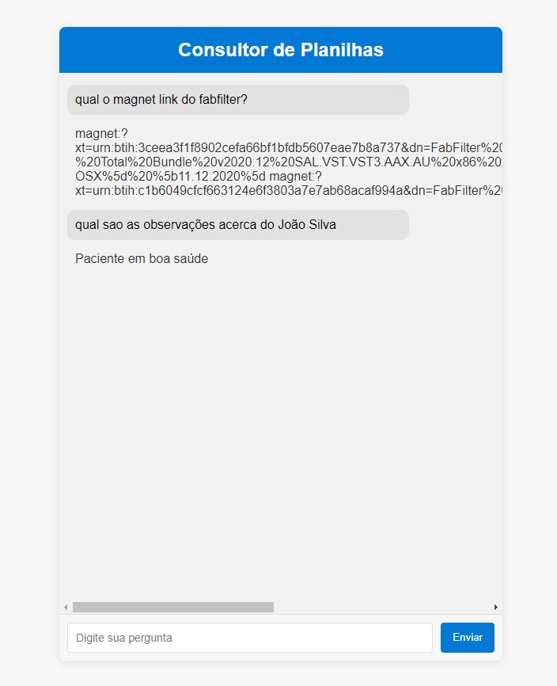

# Agente Pergunta Planilha

Este projeto implementa uma aplicação de **front-end** e **back-end** utilizando o **Flask**. O objetivo é permitir que o usuário faça perguntas sobre os dados contidos em uma planilha Excel e receba respostas com base nesses dados, utilizando a API **Google Gemini** para realizar a busca e processamento das informações.

## Funcionalidade

A aplicação permite que o usuário digite uma pergunta sobre os dados de uma planilha. O back-end, desenvolvido com Flask, se conecta à API do Google Gemini para processar a pergunta e retornar a resposta com base nas informações contidas na planilha.

### Principais Funcionalidades:
- Carregar dados de uma planilha Excel.
- Permitir que o usuário faça perguntas sobre esses dados via uma interface web.
- Integrar com a API Google Gemini para buscar respostas inteligentes com base na planilha.
- Exibir as respostas em tempo real para o usuário.

## Estrutura do Projeto

O projeto é composto por:

1. **Back-End**: API construída com Flask para processar as requisições e interagir com a API Google Gemini.
2. **Front-End**: Interface web simples onde o usuário pode digitar uma pergunta e visualizar a resposta.
3. **Planilha Excel**: Arquivo Excel utilizado como banco de dados para armazenar as informações a serem consultadas.
4. **Google Gemini API**: Utilizada para gerar respostas baseadas nos dados da planilha.

### Arquivos Importantes:
- `app.py`: Código do back-end em Flask que recebe e processa as perguntas.
- `index.html`: Interface de front-end para interação com o usuário.
- `dados.xlsx`: Arquivo Excel com os dados simulados para a aplicação.
- `captura-do-app.png`: Imagem que representa a interface do aplicativo:



## Como Usar

### Passo 1: Configuração do Ambiente
1. Clone o repositório para sua máquina local.
2. Instale as dependências:
   ```bash
   pip install -r requirements.txt
